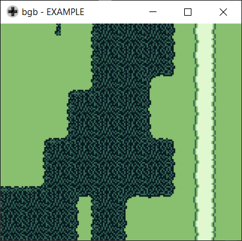

# GBScroll

<!-- TABLE OF CONTENTS -->
## Table of Contents

* [About](#about)
* [Getting Started](#getting-started)
  * [Prerequisites](#prerequisites)
  * [Building](#building)
  * [Running](#running)
* [Controls](#controls)
* [License](#license)
* [Third Party Sources](#third-party-sources)

<!-- ABOUT -->
## About

GBScroll is a toy project that implements simple top-down scrolling for a tiled game world.  I had grand designs of this becoming a 2D RPG, but ended up evolving it into a little tech demo of sorts as my priorities shifted to other projects.

It was my first dive into assembly programming for game development, so I may not be following style conventions or best practices.  Ultimately it was a fun little learning exercise.

If you would like to experiment with a developer build, please follow the instructions outlined in [Getting Started](#getting-started).  Note that only a Windows build is available at this time. 

<!-- GETTING STARTED -->
## Getting Started (Windows)

Building the project locally and running a developer build requires a few simple steps.  

### Prerequisites

The following prerequisites are required to build and run the project:
* [git](https://git-scm.com/)

### Building

1. Clone the repo with Git.
```sh
git clone https://github.com/mwhirls/gbscroll.git
```
2. Run the build step.  This will assemble the code and generate a build located in the `bin/` directory.
```sh
build.bat
```

### Running

To run the demo, simple execute the provided script.
```sh
run.bat
```

<!-- CONTROLS -->
## Controls



Use the arrow keys to control the playable sprite across the game world.

Note that the character sprite being simply another tile is expected behavior; it looks goofy, but I never got around to loading a unique sprite for it!

<!-- LICENSE -->
## License

Distributed under the MIT License. See `LICENSE` for more information.


<!-- THIRD PARTY SOURCES -->
## Third Party Sources

GBScroll has the following third-party dependencies, listed in the `external` dependencies directory.  They are the property of their original owners and I claim no ownership:
```
gbhw.inc
ibmpc1.inc
ibmpc1.inc
```

I heavily relied on the following reference for getting started in Game Boy development:

http://marc.rawer.de/Gameboy/Docs/GBCPUman.pdf
